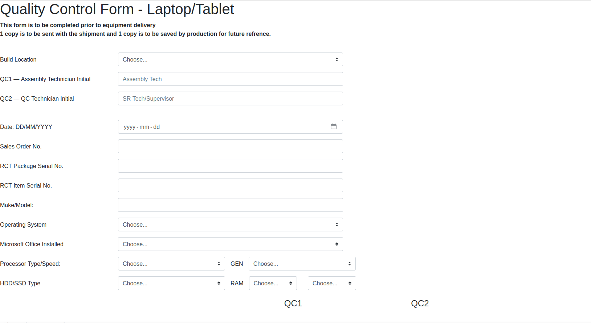
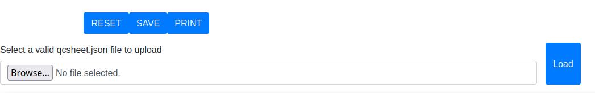
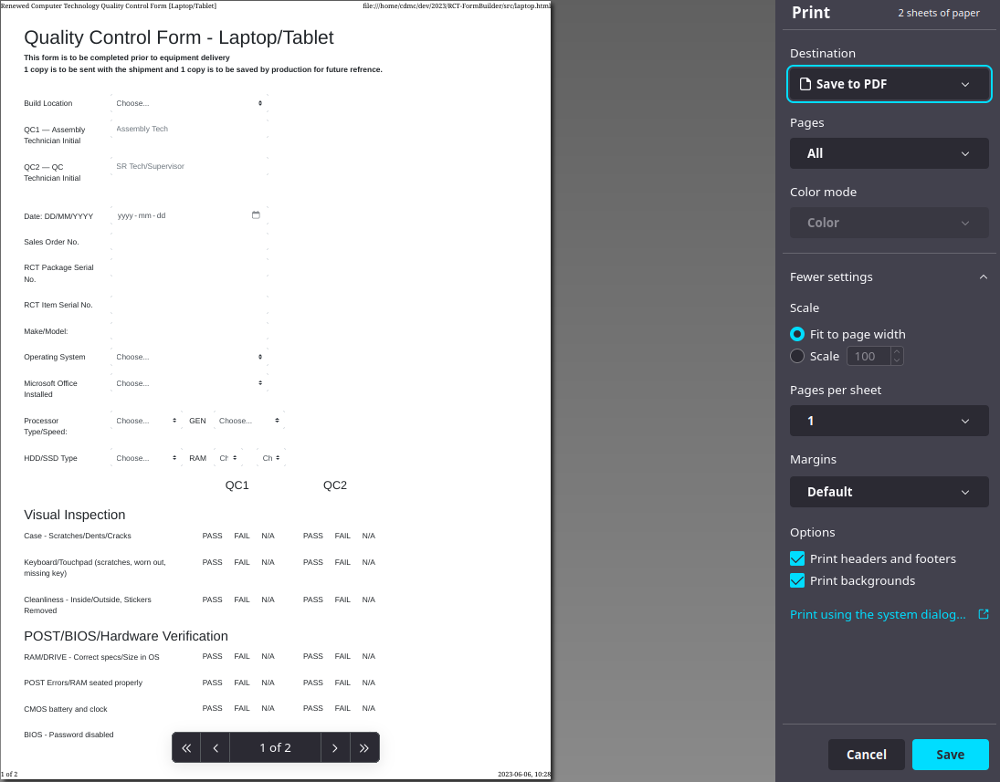

<p align="center">
  <a href="" rel="noopener">
   </a>
</p>

<h3 align="center">RCT Form-Builder</h3>

<div align="center">

  []()
  [](/LICENSE)

</div>

---

<p align="center">
    Bootstrap client-side webapp for use in internal Quality Checking of computer systems built and provided by Renewed Computer Technology Ontario.
</p>

## Table of Contents
- [About](#about)
- [Getting Started](#getting_started)
- [Usage](#usage)
- [Built Using](#built_using)
- [Authors](#authors)
- [Acknowledgments](#acknowledgement)

## About <a name="about"></a>

Renewed Computer Technology (RCT) is a not-for-profit, charitable organization that empowers learners, educators and not-for-profit organizations with increased access to information and communications technology (ICT), skill development and learning opportunities, in a socially and environmentally responsible manner.

The purpose of this application is to provide computer technicians with a simple, easy-to-use workflow app to aid in the process of quality checks while providing a finished, professional result that can be viewed internally or by clients. Data is initially saved in JSON format and finally converted by the app to a PDF for external use.

## Getting Started <a name="getting_started"></a>
To get the latest version of the application, navigate to https://github.com/Lord-Zer0/RCT-FormBuilder. Make sure to select the [main] branch (default).

### For releases
1. Select the most recent live or beta release under tags.
2. Download the zip file to your local or network machine and extract to the desired folder.
3. Open the downloaded folder and run either laptop.html or desktop.html in your browser of choice.

### For testing
1. Install Git https://git-scm.com/downloads
2. Navigate to the working directory where you would like to install the application.
3. Run the following git command in your terminal (Note: this may require an active Github Login)
```
$ git clone https://github.com/Lord-Zer0/RCT-FormBuilder.git
```
4. Open the downloaded folder and run either laptop.html or desktop.html in your browser of choice.


## Using the Application <a name="usage"></a>
Note that While the content of desktop.html and laptop.html differ, their use-cases and functionality are the same.



1. Enter the information into the above fields as per your lead tech or sr. tech's specifications, leaving any unknown fields blank.
2. During testing, for each of the listed QC checks, select either PASS, FAIL, or N/A under the QC1 column where appropriate
3. To save an in-progress QCSheet, navigate to the bottom of the page where the control panel is visible



4. The control panel operates as follows:
    - RESET will clear all data in the above form without saving.
    - SAVE creates a download link to the form's data saved in an editable JSON format. 
    - PRINT will print the document to a static PDF
    - Download only appears after clicking save, use this to save a copy of the qc data to your device's /downloads folder.
    - Use browse to choose a valid .json file to upload, all files should be in the format qcsheet-ITEMSERIALNO.json, and then select Load to import its data
5. The process of Load-Edit-Save-Download can be repeated any number of times, at any step in the qc process. Please note that most browsers default to adding a number suffix in brackets after the filename for repeat downloads, and be sure to select the most up-to-date version of that qcsheet at each step.
6. When the tech and qc processes are finished, use the PRINT function to create a finalized pdf, make sure to select "Print Backgrounds" under options. This may be hidden under "Advanced features" on some browsers. 



## Built Using <a name="built_using"></a>
- [Javascript](https://www.javascript.com/) - Functionality and services
- [Bootstrap](https://getbootstrap.com/) - Front end and layout

## Authors <a name="authors"></a>
- [@Lord_Zer0](https://github.com/Lord-Zer0) - Program developer & inital work

## Acknowledgements <a name="acknowledgement">
- [@kylelobo](https://github.com/kylelobo) - Author of [The Documentation Compendium) on Github
- All my fellow techs at RCT@Niagara who helped in the development, review, and testing
